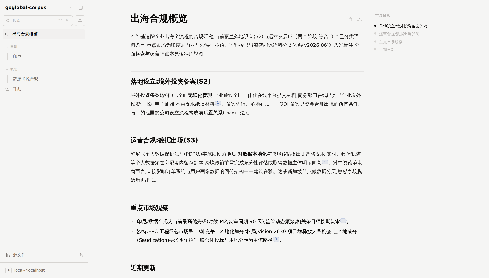

# LLM Wiki · 出海智能体语料库平台

**由 AI 构建和维护的语料知识库,内置《出海智能体语料分类体系(v2026.06)》八维分类层。**

[](https://opensource.org/licenses/Apache-2.0)

本项目基于 [lucasastorian/llmwiki](https://github.com/lucasastorian/llmwiki)(Andrej Karpathy [LLM Wiki 概念](https://gist.github.com/karpathy/442a6bf555914893e9891c11519de94f)的开源实现)深度改造:在"上传资料 → Claude 通过 MCP 编译维基"的原有能力之上,落地了出海服务语料的**八维分类、分面检索、覆盖率治理与关系层**,前端全量中文化,并剥离全部外部 SaaS 依赖,可完全离线本地运行或在自有基础设施上多用户部署。

<p align="center">
  
</p>

## 与上游的差异

| 方向 | 内容 |
|---|---|
| **八维语料层** | 受控码表(独立版本号,只增不改)、`EntryRecord` 八维条目模型与校验、标注明细 CSV 导入器(本地/托管双模式)、分面检索(15 个分面键,SQLite/Postgres 同一套)、中文全文检索(FTS5 trigram)、`lint` 完备性检查 + 覆盖率账本、Web 语料库视图(知识/业务双视图 + 覆盖率矩阵)、关系层五类边 + 复审工作清单 + KPI 仪表盘。详见 [`corpus/README.md`](corpus/README.md) |
| **前端中文化** | Web 应用的全部用户界面文本为简体中文(法律条款页除外) |
| **去 SaaS 化** | 移除 Google OAuth、Pydantic Logfire、OpenReplay;MCP/API 认证改为**平台内生成的 API 密钥**(`sv_` 前缀 Bearer),不再依赖 GoTrue 的 OAuth 2.1 服务;对象存储支持任意 S3 兼容端点(MinIO 等) |
| **自部署** | `deploy/docker-compose.selfhost.yml` + [`docs/self-hosting.md`](docs/self-hosting.md) 完整部署指南(自托管 Supabase + MinIO + docker compose) |

# 功能

- **MCP 连接** — Claude.ai、Claude Cowork、Claude Code 或任何 MCP 兼容客户端读写、检索语料与维基
- **八维语料库** — 每条语料一张"身份证"(阶段×大类主/副 + 六分面),按货架落位,分面检索、覆盖率账本、业务视图 7 类 27 场景导航
- **文件上传** — Markdown、PDF、Word、PowerPoint、Excel、图片等
- **Web 应用** — 浏览维基与源文件、语料库分面筛选、知识图谱(含关系层五类边)
- **治理闭环** — `lint` 八维检查、复审到期工作清单、KPI 仪表盘(分面完备率/货架覆盖率/时效达标率/引用溯源率)

# 两种运行模式

```
  Claude  ──MCP──►  MCP 服务 ─┐
                              │               本地模式  →  SQLite + 本机文件系统
  Web 端 ──HTTP─►  API ───────┴──►  VaultFS ─┤
                                   │          托管模式  →  Postgres + S3(MinIO)
                                   └──►  Converter(PDF / Office 文本抽取)
```

`VaultFS` 是统一抽象:同一套维基/语料操作,本地跑在 SQLite + 文件系统上,托管跑在 Postgres + S3 上,Claude 的工具行为完全一致。

- **本地模式** — 单机单用户,零外部服务。指向一个文件夹即可,文件不搬家、不上传。
- **托管(自部署)模式** — 多用户、账号体系、浏览器直传,全部组件跑在你自己的服务器上。

---

# 本地模式(快速开始)

**要求**:Python 3.11+、Node.js 20+。可选:[LibreOffice](https://www.libreoffice.org/)(抽取 Word/PPT)、`MISTRAL_API_KEY`(更高质量的 PDF OCR;默认用本地 opendataloader,无需联网)。

> **Docker 一键运行(免装任何依赖)** — 镜像内置全部运行时(Python、Node、JRE、LibreOffice、Noto CJK 字体):
>
> ```bash
> docker compose up -d        # 使用发布镜像 benjaminzhang/llmwiki-local:latest
> # 或不用 compose:
> docker run -d --name llmwiki -p 8000:8000 -p 3000:3000 \
>     -v ~/goglobal-ws:/workspace benjaminzhang/llmwiki-local:latest
> ```
>
> 打开 [localhost:3000](http://localhost:3000) 即用(compose 默认把工作区挂在 `./workspace`,用 `LLMWIKI_WORKSPACE=~/goglobal-ws` 换目录)。
>
> **连接 Claude**:容器同时以 Streamable HTTP 暴露 MCP(默认 `http://localhost:8080/mcp`,无需认证),启动完成后 `docker compose logs llmwiki` 会打印带真实端口的可粘贴配置。最快的一条命令:
>
> ```bash
> claude mcp add --transport http llmwiki http://localhost:8080/mcp
> ```
>
> 仅支持 stdio 的客户端(如 Claude Desktop)用容器桥接:
>
> ```json
> {"mcpServers": {"llmwiki": {"command": "docker", "args": ["exec", "-i", "llmwiki", "/app/llmwiki", "mcp", "/workspace"]}}}
> ```
>
> **换端口**:`LLMWIKI_API_PORT=9000 LLMWIKI_WEB_PORT=9300 LLMWIKI_MCP_PORT=9280 docker compose up -d`(`PUBLIC_*_URL` 自动对齐,设置页与启动日志随之更新);裸 `docker run` 换端口时需同时传 `-e PUBLIC_API_URL=... -e PUBLIC_MCP_URL=...`。端口默认只绑定 127.0.0.1(本地实例无鉴权),局域网访问设 `LLMWIKI_BIND=0.0.0.0`。
>
> 本地构建:`docker build -f Dockerfile.local -t llmwiki-local .`;CI 在 `master` 推送/打 tag 时自动构建并发布到 Docker Hub(需配置 `DOCKERHUB_USERNAME`/`DOCKERHUB_TOKEN` 两个仓库 secret,见 `.github/workflows/docker-publish.yml`)。用 Docker 时可跳过下面 1–3 步。

**1. 安装**

```bash
git clone https://github.com/ben0112/llmwiki-goglobal.git
cd llmwiki-goglobal
python -m venv .venv && source .venv/bin/activate
pip install -r api/requirements.txt -r mcp/requirements.txt
cd web && npm install && cd ..
```

**2. 指向一个资料文件夹** — 初始化工作区、建立本地检索索引、启动 API 与 Web 应用,并打开 [localhost:3000](http://localhost:3000):

```bash
./llmwiki open ~/goglobal-ws
```

其他子命令:`init`(仅初始化)、`serve`(仅启动服务)、`reindex`(强制重建索引)。

**3. 连接 Claude(MCP)**

```bash
./llmwiki mcp-config ~/goglobal-ws
```

把输出的 JSON 粘贴到 `claude_desktop_config.json`(Claude Desktop)或 `.claude/settings.json`(Claude Code)。一个工作区对应一个 MCP server 条目。然后对 Claude 说:*"先读 guide,然后收录我的资料并开始构建维基。"*

> 接入其他智能体(Codex CLI、Hermes、OpenClaw 等)以及托管模式的 API 密钥认证,见 **[`docs/agent-integration.md`](docs/agent-integration.md)**。

**4. 导入标注语料(可选)** — 若已有 LLM 标注工具包产出的 `标注明细.csv`:

```bash
# 校验(不写入,报告出在 CSV 同目录 corpus_import_dryrun/)
python3 -m corpus.import_annotations \
    --csv 标注结果/标注明细_业务视图.csv \
    --workspace ~/goglobal-ws --dry-run

# 导入(--raw 提供收录语料目录时,正文一并入条目)
python3 -m corpus.import_annotations \
    --csv 标注结果/标注明细_业务视图.csv \
    --workspace ~/goglobal-ws \
    --raw 审核结果_deepseek/收录
```

导入后工作区侧边栏出现**语料库**入口(分面筛选、覆盖率矩阵、业务视图),MCP `search` 支持分面过滤,`lint` 输出八维完备性与覆盖率账本。重跑幂等。

**5. 磁盘上发生了什么** — 工作区只新增两样东西,源文件绝不移动或修改:

```
~/goglobal-ws/               # 你的文件,原样不动
  papers/xxx.pdf
  notes.md
  corpus/S2-G1/S2-G1-政策-GEN-3F2A1.md   # 导入的语料条目(YAML frontmatter 携带八维)
  wiki/                      # Claude 生成的维基页面(普通 markdown)
    overview.md
    log.md
  .llmwiki/                  # 检索索引 + 缓存 —— 可随时删除重建
    index.db
    cache/
```

文件系统是真相源,索引只是加速层;后台 watcher 会同步你在外部编辑器里做的修改。

**6. 让它自我维护(可选)** — 用 Claude Routine 定时执行,例如每晚:

> *先读 guide。找出上次运行以来工作区新增的内容(上传、笔记与高亮),逐一阅读并更新维基:该建页建页、该并入并入、修正受影响的交叉引用。用 `search(mode="references", query="due")` 拉取复审到期清单并处理。最后在 `wiki/log.md` 追加一条变更摘要。*

---

# 自部署(多用户托管模式)

完整步骤见 **[`docs/self-hosting.md`](docs/self-hosting.md)**,这里是概览。

**架构** — 五个公网域名 + 两个内部服务:

| 组件 | 自托管方案 |
|---|---|
| Postgres + 账号认证 | 自托管 Supabase(官方 docker compose;仅需 db/auth/kong) |
| 对象存储 | MinIO(或任意 S3 兼容存储,经 `S3_ENDPOINT_URL`) |
| api / mcp / converter | `deploy/docker-compose.selfhost.yml` |
| Web 前端 | `web/Dockerfile` 构建镜像(`NEXT_PUBLIC_*` 构建期烧入) |

**步骤**:

```bash
# 1) 起 Supabase(官方自托管 compose,生成新的 JWT_SECRET/ANON_KEY),
#    然后按序执行本仓库的数据库迁移:
for f in supabase/migrations/*.sql; do psql "$DATABASE_URL" -f "$f"; done

# 2) 起应用服务
cp deploy/.env.selfhost.example deploy/.env.selfhost   # 填齐所有 CHANGE-ME
docker compose -f deploy/docker-compose.selfhost.yml \
    --env-file deploy/.env.selfhost up -d --build

# 3) 验证
curl -fsS https://api.example.com/health     # {"status":"ok"}
curl -fsS https://mcp.example.com/health     # ok
```

**要点**:

- **登录方式只有邮箱密码**(GoTrue 原生支持),无任何外部身份提供商。
- **MCP / API 用 API 密钥**:每个用户在 **设置 → 连接 Claude (MCP)** 生成 `sv_` 密钥,作为静态 `Authorization: Bearer` 头同时通行 MCP 与 REST API(SHA-256 哈希存储、可吊销、记录最近使用时间)。无需 OAuth 服务。
- **`api` 只跑一个副本**(TUS 上传状态、WebSocket 连接与图谱重建锁为进程内状态)。
- **converter 与 Postgres 不得暴露公网**;MinIO 的 S3 端口需公网可达(浏览器直传预签名 URL)。

**托管模式导入语料** — 直接写入 Postgres,条目落入指定账号的知识库,分面检索/Web 语料库/lint/关系层即刻可用:

```bash
python3 -m corpus.import_annotations \
    --csv 标注结果/标注明细_业务视图.csv \
    --database-url "$DATABASE_URL" \
    --user-email corpus-admin@example.com \
    --kb goglobal-corpus \
    --raw 审核结果_deepseek/收录
```

账号须已注册;知识库不存在则自动创建;单事务、幂等。

---

# 智能体能做什么(MCP 工具)

任何 MCP 客户端(Claude、Codex CLI、Hermes、OpenClaw 等)均可调用下列工具;各客户端的配置与认证步骤见 [`docs/agent-integration.md`](docs/agent-integration.md)。

| 工具 | 作用 |
|------|------|
| `guide` | 首次调用:说明知识库结构与工作方式 |
| `create_knowledge_base` / `list_knowledge_bases` | 建库/列库 |
| `search` | 文件浏览、全文检索(中文 trigram 分词)、**分面过滤**(`facets={"domain":"Z1","country":"IDN",...}`)、引用图谱查询;`query="due"` 返回复审到期工作清单 |
| `read` | 读取文档(单文件或 glob 批量、PDF/Office 页码区间、可含图片) |
| `create` / `edit` / `append` / `delete` | 维基页面与资产的增删改(`overview.md`/`log.md` 受保护) |
| `relate` | 维护**关系层五类边**:`is_a` 上下位 · `next` 前后置 · `routes_to` 路径衔接 · `governed_by` 归口映射 · `serves` 阶段服务包(跨内容重建持久保留) |
| `lint` | 引用可解析性、悬空链接、孤立/过期页面;已分类语料的**八维完备性检查 + 覆盖率账本 + KPI** |

# 支持的文件类型

| 类型 | 格式 | 处理方式 |
|------|------|----------|
| PDF | `.pdf` | 本地抽取文本与图表;设 `MISTRAL_API_KEY` 可提升表格/复杂版面 OCR 质量 |
| Office | `.docx` `.doc` `.pptx` `.ppt` | LibreOffice 转换后抽取(需本机安装 LibreOffice) |
| 表格 | `.xlsx` `.xls` | 逐表抽取 |
| 网页 | `.html` `.htm` | 清洗为可读 Markdown,去导航与广告 |
| 文本与数据 | `.md` `.txt` `.csv` `.json` `.xml` `.yaml` `.svg` 等 | 直接索引分块 |
| 图片 | `.png` `.jpg` `.webp` `.gif` | 存储并内联展示,Claude 可按需读取 |

# 许可证

Apache 2.0 — 见 [LICENSE](LICENSE)。上游项目:[lucasastorian/llmwiki](https://github.com/lucasastorian/llmwiki)。
