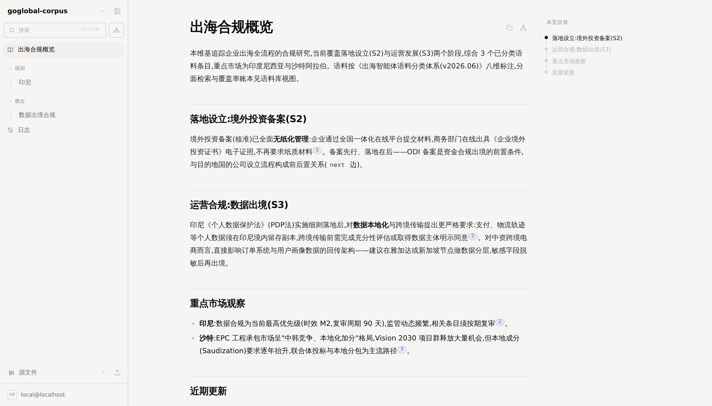

# LLM Wiki · 出海智能体语料库平台

**由 AI 构建和维护的语料知识库,内置《出海智能体语料分类体系(v2026.06)》八维分类层。**

[](https://opensource.org/licenses/Apache-2.0)

本项目基于 [lucasastorian/llmwiki](https://github.com/lucasastorian/llmwiki)(Andrej Karpathy [LLM Wiki 概念](https://gist.github.com/karpathy/442a6bf555914893e9891c11519de94f)的开源实现)深度改造:在"上传资料 → AI 智能体通过 MCP 编译维基"的原有能力之上,落地了出海服务语料的**八维分类、分面检索、覆盖率治理与关系层**,前端全量中文化,并剥离全部外部 SaaS 依赖,可完全离线本地运行或在自有基础设施上多用户部署。

<p align="center">
  
</p>

## 与上游的差异

| 方向 | 内容 |
|---|---|
| **八维语料层** | 受控码表(独立版本号,只增不改)、`EntryRecord` 八维条目模型与校验、标注明细 CSV 导入器(本地/托管双模式)、分面检索(15 个分面键,SQLite/Postgres 同一套)、中文全文检索(FTS5 trigram)、`lint` 完备性检查 + 覆盖率账本、Web 语料库视图(知识/业务双视图 + 覆盖率矩阵)、关系层五类边 + 复审工作清单 + KPI 仪表盘。详见 [`corpus/README.md`](corpus/README.md) |
| **前端中文化** | Web 应用的全部用户界面文本为简体中文(法律条款页除外) |
| **去 SaaS 化** | 移除 Google OAuth、Pydantic Logfire、OpenReplay;MCP/API 认证改为**平台内生成的 API 密钥**(`sv_` 前缀 Bearer),不再依赖 GoTrue 的 OAuth 2.1 服务;对象存储支持任意 S3 兼容端点(MinIO 等) |
| **自部署** | `deploy/docker-compose.selfhost.yml` + [`docs/self-hosting.md`](docs/self-hosting.md) 完整部署指南(自托管 Supabase + MinIO + docker compose) |

# 功能

- **MCP 连接** — 任何 MCP 兼容客户端(桌面端、CLI、网页端智能体)读写、检索语料与维基
- **八维语料库** — 每条语料一张"身份证"(阶段×大类主/副 + 六分面),按货架落位,分面检索、覆盖率账本、业务视图 7 类 27 场景导航
- **文件上传** — Markdown、PDF、Word、PowerPoint、Excel、图片等
- **Web 应用** — 浏览维基与源文件、语料库分面筛选、知识图谱(含关系层五类边)
- **治理闭环** — `lint` 八维检查、复审到期工作清单、KPI 仪表盘(分面完备率/货架覆盖率/时效达标率/引用溯源率)

# 两种运行模式

```
  AI 智能体 ──MCP──►  MCP 服务 ─┐
                              │               本地模式  →  SQLite + 本机文件系统
  Web 端 ──HTTP─►  API ───────┴──►  VaultFS ─┤
                                   │          托管模式  →  Postgres + S3(MinIO)
                                   └──►  Converter(PDF / Office 文本抽取)
```

`VaultFS` 是统一抽象:同一套维基/语料操作,本地跑在 SQLite + 文件系统上,托管跑在 Postgres + S3 上,MCP 工具行为完全一致。

- **本地模式** — 单机单用户,零外部服务。指向一个文件夹即可,文件不搬家、不上传。
- **托管(自部署)模式** — 多用户、账号体系、浏览器直传,全部组件跑在你自己的服务器上。

---

# 本地模式(快速开始)

**要求**:Python 3.11+、Node.js 20+。可选:[LibreOffice](https://www.libreoffice.org/)(抽取 Word/PPT)、`MISTRAL_API_KEY`(更高质量的 PDF OCR;默认用本地 opendataloader,无需联网)。

> **Docker 一键运行(免装任何依赖)** — 镜像内置全部运行时(Python、Node、JRE、LibreOffice、Noto CJK 字体):
>
> ```bash
> docker compose up -d        # 使用发布镜像 benjaminzhang/llmwiki-local:latest
> # 或不用 compose:
> docker run -d --name llmwiki -p 9000:8000 -p 3000:3000 \
>     -v ~/goglobal-ws:/workspace benjaminzhang/llmwiki-local:latest
> ```
>
> 打开 [localhost:3000](http://localhost:3000) 即用(compose 默认把工作区挂在 `./workspace`,用 `LLMWIKI_WORKSPACE=~/goglobal-ws` 换目录)。
>
> **连接 AI 助手(MCP)**:容器同时以 Streamable HTTP 暴露 MCP(默认 `http://localhost:8080/mcp`,无需认证),启动完成后 `docker compose logs llmwiki` 会打印带真实端口的可粘贴配置:
>
> ```json
> {"mcpServers": {"llmwiki": {"url": "http://localhost:8080/mcp"}}}
> ```
>
> 仅支持 stdio 的客户端用容器桥接:
>
> ```json
> {"mcpServers": {"llmwiki": {"command": "docker", "args": ["exec", "-i", "llmwiki", "/app/llmwiki", "mcp", "/workspace"]}}}
> ```
>
> **端口**:API 宿主机默认 `9000`(容器内固定 8000,避开本机 LLM 推理栈常占的 8000)、Web `3000`、MCP `8080`。换端口:`LLMWIKI_API_PORT=9100 LLMWIKI_WEB_PORT=9300 LLMWIKI_MCP_PORT=9280 docker compose up -d`(`PUBLIC_*_URL` 自动对齐,设置页与启动日志随之更新);裸 `docker run` 换端口时需同时传 `-e PUBLIC_API_URL=... -e PUBLIC_MCP_URL=...`。端口默认只绑定 127.0.0.1(本地实例无鉴权),局域网访问设 `LLMWIKI_BIND=0.0.0.0`。
>
> 本地构建:`docker build -f Dockerfile.local -t llmwiki-local .`;CI 在 `master` 推送/打 tag 时自动构建并发布到 Docker Hub(需配置 `DOCKERHUB_USERNAME`/`DOCKERHUB_TOKEN` 两个仓库 secret,见 `.github/workflows/docker-publish.yml`)。用 Docker 时可跳过下面 1–3 步。

**1. 安装**

```bash
git clone https://github.com/ben0112/llmwiki-goglobal.git
cd llmwiki-goglobal
python -m venv .venv && source .venv/bin/activate
pip install -e . --no-deps
pip install -r api/requirements.txt -r mcp/requirements.txt
cd web && npm install && cd ..
```

**2. 指向一个资料文件夹** — 初始化工作区、建立本地检索索引、启动 API 与 Web 应用,并打开 [localhost:3000](http://localhost:3000):

```bash
./llmwiki open ~/goglobal-ws
```

其他子命令:`init`(仅初始化)、`serve`(仅启动服务)、`reindex`(强制重建索引)。

**3. 连接 AI 助手(MCP)**

```bash
./llmwiki mcp-config ~/goglobal-ws
```

把输出的 JSON 合并进你所用 MCP 客户端的配置(`mcpServers` 段)。一个工作区对应一个 MCP server 条目。然后对智能体说:*"先读 guide,然后收录我的资料并开始构建维基。"*

> 各类智能体的接入方式(Codex CLI、Hermes、OpenClaw 等)以及托管模式的 API 密钥认证,见 **[`docs/agent-integration.md`](docs/agent-integration.md)**。

**4. 导入标注语料(可选)** — 若已有 LLM 标注工具包产出的 `标注明细.csv`:

```bash
# 校验(不写入,报告出在 CSV 同目录 corpus_import_dryrun/)
python3 -m corpus.import_annotations \
    --csv 标注结果/标注明细_业务视图.csv \
    --workspace ~/goglobal-ws --dry-run

# 导入(--raw 提供收录语料目录时,正文一并入条目)
python3 -m corpus.import_annotations \
    --csv 标注结果/标注明细_业务视图.csv \
    --workspace ~/goglobal-ws \
    --raw 审核结果_deepseek/收录
```

导入后工作区侧边栏出现**语料库**入口(分面筛选、覆盖率矩阵、业务视图),MCP `search` 支持分面过滤,`lint` 输出八维完备性与覆盖率账本。重跑幂等。

**5. 磁盘上发生了什么** — 工作区只新增两样东西,源文件绝不移动或修改:

```
~/goglobal-ws/               # 你的文件,原样不动
  papers/xxx.pdf
  notes.md
  corpus/S2-G1/S2-G1-政策-GEN-3F2A1.md   # 导入的语料条目(YAML frontmatter 携带八维)
  wiki/                      # AI 生成的维基页面(普通 markdown)
    overview.md
    log.md
  .llmwiki/                  # 检索索引 + 缓存 —— 可随时删除重建
    index.db
    cache/
```

文件系统是真相源,索引只是加速层;后台 watcher 会同步你在外部编辑器里做的修改。

**6. 让它自我维护(可选)** — 用智能体的定时任务(Routines / cron)执行,例如每晚:

> *先读 guide。找出上次运行以来工作区新增的内容(上传、笔记与高亮),逐一阅读并更新维基:该建页建页、该并入并入、修正受影响的交叉引用。用 `search(mode="references", query="due")` 拉取复审到期清单并处理。最后在 `wiki/log.md` 追加一条变更摘要。*

---

# 自部署(多用户托管模式)

完整步骤见 **[`docs/self-hosting.md`](docs/self-hosting.md)**,这里是概览。

**架构** — 五个公网域名 + 两个内部服务:

| 组件 | 自托管方案 |
|---|---|
| Postgres + 账号认证 | 自托管 Supabase(官方 docker compose;仅需 db/auth/kong) |
| 对象存储 | MinIO(或任意 S3 兼容存储,经 `S3_ENDPOINT_URL`) |
| gateway / api / worker / mcp / converter | `deploy/docker-compose.selfhost.yml`；API 与 durable worker 可独立横向扩容 |
| Web 前端 | `web/Dockerfile` 构建镜像(`NEXT_PUBLIC_*` 构建期烧入) |

**步骤**:

```bash
# 1) 起 Supabase(官方自托管 compose,生成新的 JWT_SECRET/ANON_KEY),
#    然后按序执行本仓库的数据库迁移:
for f in supabase/migrations/*.sql; do psql "$DATABASE_URL" -f "$f"; done

# 2) 起应用服务
cp deploy/.env.selfhost.example deploy/.env.selfhost   # 填齐所有 CHANGE-ME
docker compose -f deploy/docker-compose.selfhost.yml \
    --env-file deploy/.env.selfhost up -d --build

# 3) 验证
curl -fsS https://api.example.com/health     # {"status":"ok"}
curl -fsS https://mcp.example.com/health     # ok
```

**要点**:

- **登录方式只有邮箱密码**(GoTrue 原生支持),无任何外部身份提供商。
- **MCP / API 用 API 密钥**:每个用户在 **设置 → 连接 AI 助手 (MCP)** 生成 `sv_` 密钥,作为静态 `Authorization: Bearer` 头同时通行 MCP 与 REST API(SHA-256 哈希存储、可吊销、记录最近使用时间)。无需 OAuth 服务。
- **Hosted 默认使用 durable worker、Redis AOF 与 S3 multipart TUS**；Postgres 是任务账本，API 无进程内已接受任务或上传状态。可用 `--scale api=2 --scale worker=2` 独立扩容，gateway 是唯一公网 API 入口。架构与恢复规则见 [`docs/architecture/durable-jobs.md`](docs/architecture/durable-jobs.md)。
- **converter 与 Postgres 不得暴露公网**;MinIO 的 S3 端口需公网可达(浏览器直传预签名 URL)。

**托管模式导入语料** — 直接写入 Postgres,条目落入指定账号的知识库,分面检索/Web 语料库/lint/关系层即刻可用:

```bash
python3 -m corpus.import_annotations \
    --csv 标注结果/标注明细_业务视图.csv \
    --database-url "$DATABASE_URL" \
    --user-email corpus-admin@example.com \
    --kb goglobal-corpus \
    --raw 审核结果_deepseek/收录
```

账号须已注册;知识库不存在则自动创建;单事务、幂等。

## 服务端 RAG CLI（托管模式）

服务端 RAG 默认关闭；管理员需在 API 与 durable worker 上显式启用 `SERVER_RAG_ENABLED=true`，并配置服务端模型 profile。CLI 只调用 LLMWiki REST，不接受模型供应商的 API key 或 base URL。`LLMWIKI_ACCESS_TOKEN` 用于认证 LLMWiki REST，**不是**模型供应商密钥。

从部署环境或 secret manager 加载 LLMWiki 地址和访问令牌，不要把令牌写入命令行或仓库：

```bash
export LLMWIKI_API_URL=https://api.example.com
: "${LLMWIKI_ACCESS_TOKEN:?load the LLMWiki REST token from your secret store}"
export LLMWIKI_ACCESS_TOKEN
```

创建并观察一次构建；`--json` 输出适合脚本消费的紧凑 JSON：

```bash
PYTHONPATH=api python -m scripts.rag build-wiki \
  --knowledge-base 00000000-0000-0000-0000-000000000001 \
  --goal "Build launch guidance" \
  --target-prefix /wiki/launch/ \
  --model-profile primary \
  --idempotency-key launch-2026-07-26 \
  --json

PYTHONPATH=api python -m scripts.rag status \
  00000000-0000-0000-0000-000000000002 --json

PYTHONPATH=api python -m scripts.rag steps \
  00000000-0000-0000-0000-000000000002 \
  --after 0 --limit 50 --json
```

dry-run 仍创建持久 run，但不提交页面；预算参数均在发起网络请求前校验：

```bash
PYTHONPATH=api python -m scripts.rag build-wiki \
  --knowledge-base 00000000-0000-0000-0000-000000000001 \
  --goal "Preview launch guidance" \
  --target-prefix /wiki/launch/ \
  --model-profile primary \
  --idempotency-key launch-preview-1 \
  --dry-run --max-pages 3 --max-model-tokens 12000 --json
```

失败 run 可用更高预算显式续跑：

```bash
PYTHONPATH=api python -m scripts.rag resume \
  00000000-0000-0000-0000-000000000002 \
  --idempotency-key launch-resume-1 \
  --max-pages 6 --max-model-tokens 24000 --json
```

取消仍由通用 durable job API 负责；使用 create 响应中的 `job_id`：

```bash
JOB_ID=00000000-0000-0000-0000-000000000003
curl -fsS -X POST "$LLMWIKI_API_URL/v1/jobs/$JOB_ID/cancel" --config - <<CURL_CONFIG
header = "Authorization: Bearer $LLMWIKI_ACCESS_TOKEN"
CURL_CONFIG
```

CLI 退出码：`0` 成功，`2` 参数或本地配置错误，`3` REST/传输失败，`4` 输出失败。错误只输出稳定的 `code`/`category`，不会回显 bearer token、goal、供应商端点、响应正文或异常链。

---

# 智能体能做什么(MCP 工具)

任何 MCP 客户端(Codex CLI、Hermes、OpenClaw 等)均可调用下列工具;各客户端的配置与认证步骤见 [`docs/agent-integration.md`](docs/agent-integration.md)。

| 工具 | 作用 |
|------|------|
| `guide` | 首次调用:说明知识库结构与工作方式 |
| `create_knowledge_base` / `list_knowledge_bases` | 建库/列库 |
| `search` | 文件浏览、全文检索(中文 trigram 分词)、**分面过滤**(`facets={"domain":"Z1","country":"IDN",...}`)、引用图谱查询;`query="due"` 返回复审到期工作清单 |
| `read` | 读取文档(单文件或 glob 批量、PDF/Office 页码区间、可含图片) |
| `create` / `edit` / `append` / `delete` | 维基页面与资产的增删改(`overview.md`/`log.md` 受保护) |
| `relate` | 维护**关系层五类边**:`is_a` 上下位 · `next` 前后置 · `routes_to` 路径衔接 · `governed_by` 归口映射 · `serves` 阶段服务包(跨内容重建持久保留) |
| `lint` | 引用可解析性、悬空链接、孤立/过期页面;已分类语料的**八维完备性检查 + 覆盖率账本 + KPI** |

# 支持的文件类型

| 类型 | 格式 | 处理方式 |
|------|------|----------|
| PDF | `.pdf` | 本地抽取文本与图表;设 `MISTRAL_API_KEY` 可提升表格/复杂版面 OCR 质量 |
| Office | `.docx` `.doc` `.pptx` `.ppt` | LibreOffice 转换后抽取(需本机安装 LibreOffice) |
| 表格 | `.xlsx` `.xls` | 逐表抽取 |
| 网页 | `.html` `.htm` | 清洗为可读 Markdown,去导航与广告 |
| 文本与数据 | `.md` `.txt` `.csv` `.json` `.xml` `.yaml` `.svg` 等 | 直接索引分块 |
| 图片 | `.png` `.jpg` `.webp` `.gif` | 存储并内联展示,智能体可按需读取 |

# 检索评测 CLI

仓库内置版本化的纯合成检索 cohort，可在不连接数据库、向量服务或外部 API 的情况下复现 lexical baseline：

```bash
PYTHONPATH=api python -m scripts.retrieval_eval \
  --dataset tests/fixtures/retrieval/v1/cases.jsonl \
  --profile lexical \
  --output-json retrieval-baseline.json
```

CLI 从 dataset 同目录严格读取 `corpus.jsonl`，先应用 area、scope、facets、path glob、tags、document kind 与 annotated-only 过滤，再按正文/annotation 词项命中及标题排序信号产生可解释的确定性排名。它不会读取 relevance judgments 来生成排名。`--output-json` 使用临时文件加原子替换；已有普通文件可覆盖，目录、符号链接及其他非普通文件会被拒绝。stdout 与输出文件字节完全相同。

在部署环境中比较该租户/知识库的真实 Postgres lexical 与 hybrid，并把 promotion gate 作为门禁。先通过 secret manager 或部署环境加载 `DATABASE_URL`、`EMBEDDING_BASE_URL`、`EMBEDDING_API_KEY`、`EMBEDDING_MODEL`、`EMBEDDING_DIMENSIONS` 及 `HYBRID_*` 配置；不要把 DSN 或 API key 写进命令行：

```bash
: "${DATABASE_URL:?load DATABASE_URL from the deployment secret store}"
: "${EMBEDDING_BASE_URL:?load EMBEDDING_BASE_URL}"
: "${EMBEDDING_MODEL:?load EMBEDDING_MODEL}"
: "${EMBEDDING_DIMENSIONS:?load EMBEDDING_DIMENSIONS}"
export HYBRID_SEARCH_ENABLED=true
export RETRIEVAL_EVAL_USER_ID=00000000-0000-0000-0000-000000000001
export RETRIEVAL_EVAL_KNOWLEDGE_BASE_ID=00000000-0000-0000-0000-000000000002
PYTHONPATH=api python -m scripts.retrieval_eval \
  --dataset /controlled/private-retrieval-cases.jsonl \
  --compare \
  --hosted \
  --require-promotion-gate \
  --output-json /controlled/private-retrieval-report.json
```

lexical 是本地与托管模式的默认检索路径，不依赖模型或网络。托管模式已支持可选的 pgvector hybrid 检索：只有调用方显式传入 `retrieval_profile="hybrid"` 且 `HYBRID_SEARCH_ENABLED=true` 时才启用；通过 promotion gate 也只代表该 profile 有资格灰度，不会自动打开开关或改变默认值。向量存储/服务故障先在 adapter 边界清洗，再以已分类的可用性故障回退到 lexical 并标记 `lexical_fallback`；配置错误、lexical 故障、租户隔离错误及非可用性类意外错误不会被静默吞掉。

`--hosted` 是受支持的真实 Postgres 入口，不需要 Python 级 retriever factory 注入。缺失/非法的静态 hosted 配置（租户、知识库、embedding profile 或空 DSN）会以稳定的 `hybrid_unavailable` 失败关闭；非空但格式错误、不可连接或运行时失效的 DSN 在创建 pool 时会被清洗为 `retrieval_failed`，不会回显连接信息。真实比较在同一只读 `REPEATABLE READ` 快照和同一 dataset digest 上执行；lexical 侧与 serving MCP 复用唯一的 Postgres compiler，执行完全相同的 PGroonga `&@~`、`pgroonga_score`、状态、scope、过滤和排序语义，不使用 evaluator 专有的全文检索近似。成功、失败和进程控制路径都会执行并验证数据库池与 embedding client 的异步清理，清理自身抛出的控制信号会被清洗后传播。门槛是 hybrid Recall@10 至少为 lexical 的 110%，且 p95 延迟不超过 lexical 的 2.0 倍。配置、模型安全切换、回填/重嵌入、私有评测集、迁移、灰度及回滚流程见 [`docs/architecture/retrieval.md`](docs/architecture/retrieval.md)。

退出码：`0` 表示评测成功（未要求 gate 时，即使 promotion 不合格仍为 `0`）；`2` 表示参数、dataset、配置或 retrieval 错误；`3` 表示 `--require-promotion-gate` 已启用且 hybrid 未通过；`4` 表示报告输出失败。错误输出只含稳定的 `code`/`category`，不会回显路径、查询、文档内容或底层异常。

当前 v1 synthetic lexical baseline（单行、键排序稳定）：

```json
{"case_count":2,"dataset_schema_version":1,"evaluation_dataset_digest":"5d9969be5644602a859b1d25eba44e3881b61eb11fd84a4eb2aec1edea5e02c5","metrics":{"filtered_result_count":3,"latency_p50_ms":0.0,"latency_p95_ms":0.0,"mrr":1.0,"ndcg_at_10":1.0,"recall_at_10":1.0,"recall_at_20":1.0,"recall_at_5":1.0},"profile":"lexical","schema_version":1}
```

报告只包含 dataset identity、profile 与聚合指标；不会写出 query text、document content、API key、embedding 或原始异常字符串。baseline latency 来自 retriever 的 `SearchResult.latency_ms`（合成 adapter 固定为 `0.0`），不把 wall-clock jitter 写入稳定报告。

# 许可证

Apache 2.0 — 见 [LICENSE](LICENSE)。上游项目:[lucasastorian/llmwiki](https://github.com/lucasastorian/llmwiki)。
