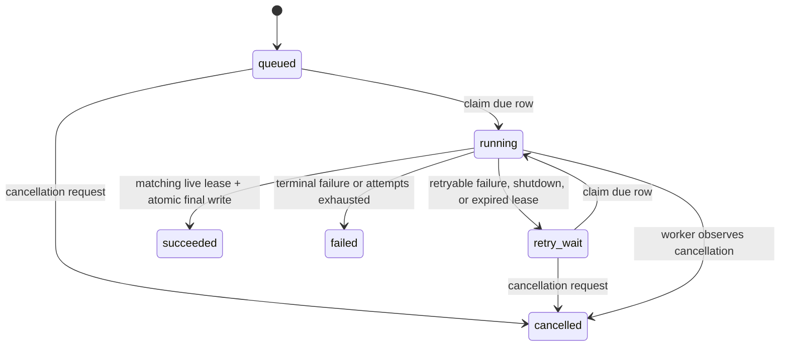

# Durable Hosted Jobs and Resumable Uploads

Hosted execution is an at-least-once system: Postgres owns job truth and
leases, Redis transports job UUIDs and stores short-lived upload coordination,
and S3/MinIO owns upload bytes. API replicas do not own accepted work. Local
mode keeps its SQLite, filesystem, and in-process execution path.

## Job states, leases, and compare-and-swap rules



- A claim changes only a due `queued`/`retry_wait` row, increments
  `attempt_count`, and writes `lease_owner`, `heartbeat_at`, and
  `lease_expires_at` using database time.
- Heartbeat, progress, success, and failure updates require `state=running`,
  the same owner, and a lease whose expiry is later than database time.
- Final document pages/chunks/assets or graph edges are replaced in the same
  transaction that validates the live lease. A stale worker cannot publish.
- The reaper locks expired candidates with `SKIP LOCKED`, clears ownership,
  and moves them to `retry_wait`, `failed`, or `cancelled`.
- ARQ deduplication is an optimization. Duplicate messages that lose the
  Postgres claim return `duplicate` without calling a handler.

## Transaction boundaries

URL ingest reserves quota and uploads the source, then one Postgres transaction
creates the document and idempotent `document.extract` job. Any failed database
write compensates the object and reservation; an uncertain commit is reconciled
before deletion.

TUS creation reserves quota, creates the S3 multipart upload, then creates a
Redis reservation marker and session while holding a token lock. A PATCH writes
an S3 part first and advances Redis offset only after receiving its ETag. Final
PATCH completes and validates the object, then one Postgres transaction creates
the document and job. Confirmed rollback deletes the orphan; uncertain commit
keeps the object/session for reconciliation. Repeated final PATCH returns the
stored document/job IDs.

## Error policy

| Class | Examples | Ledger outcome |
|---|---|---|
| Retryable | converter/S3 timeout, transient database failure, worker shutdown, expired lease | `retry_wait` with deterministic backoff while attempts remain |
| Terminal | unsupported handler, invalid bounded result, invalid source | `failed` immediately |
| Cancellation | user cancellation observed under a live lease | `cancelled` |
| Lease loss | heartbeat/commit CAS rejects stale owner | no stale write; current generation remains authoritative |
| Attempts exhausted | retryable failure on final attempt | `failed` with `attempts_exhausted` |

Persisted and logged errors are bounded codes and safe messages. Handler
payloads, object URLs, source content, JWTs, and credentials are never logged.

## Redis keys and retention

| Key | Purpose | Retention |
|---|---|---|
| ARQ queue/in-progress keys | UUID-only delivery transport | ARQ job lifecycle; result retention disabled |
| `tus:session:{upload_id}` | offset, ETags, tenant IDs, multipart ID, completion IDs | `TUS_SESSION_TTL_SECONDS` (default 48h), renewed by activity |
| `tus:lock:{upload_id}` | token-fenced mutation lock | `TUS_LOCK_SECONDS` (default 60s), renewed while active |
| `tus:reservation:{user_id}:{upload_id}` | idempotent quota settlement marker | session TTL, then settled/deleted by cleanup |
| quota reservation/hash keys | live per-user reserved bytes and generation tokens | session TTL, renewed/finalized/released by CAS |

Redis runs with AOF `appendonly yes` and `appendfsync everysec`. A restart
reconstructs the serialized session; clients resume from the last committed
offset. Postgres remains sufficient to reconstruct job delivery if Redis loses
ARQ messages.

## Multipart limits

Non-final S3 multipart parts are at least 5 MiB. A session accepts at most
10,000 parts and enforces declared upload length plus `TUS_MAX_PATCH_BYTES`.
Offset CAS happens after ETag receipt. Completion validates object length and
file signature before document persistence.

## Security and tenant boundaries

Authenticated APIs filter job reads/cancellation by `user_id`. Worker service
queries carry the persisted tenant and resource IDs and revalidate ownership
before side effects. Redis keys use opaque UUIDs; knowing an upload/job ID is
not authorization. Session metadata has a closed schema and bounded strings.
S3 keys and multipart IDs never enter operational telemetry.

## Operational telemetry

Each line is JSON. Stable events are `durable_job_dispatched`,
`durable_job_finished`, `durable_job_lease_reaped`, `tus_session_created`,
`tus_session_completed`, `tus_session_stale`, `quota_reserved`,
`quota_released`, and `upload_cleanup_finished`. Fields include the relevant
`job_id`, `job_type`, `attempt`, `state`, `lease_owner`, `duration_ms`,
`error_code`, `dispatch_attempts`, `upload_id`, byte count, and `replica_role`.

Example queries:

```bash
docker compose -f deploy/docker-compose.selfhost.yml logs --no-color api worker \
  | jq -R 'fromjson? | select(.event == "durable_job_lease_reaped")'
docker compose -f deploy/docker-compose.selfhost.yml logs --no-color api worker \
  | jq -R 'fromjson? | select(.upload_id == "UPLOAD_UUID")'
```

## Backup, recovery, rollback, and scaling

- Back up Postgres and S3 as the durable business stores. Persist the Redis AOF
  volume to preserve upload resume state; losing it does not lose committed
  documents or ledger jobs, but active multipart sessions require cleanup.
- After Redis recovery, dispatch scans redeliver due Postgres jobs. After a
  worker crash, the reaper creates a new delivery generation when its lease
  expires. Stale upload scans create idempotent `upload.cleanup` jobs.
- Roll back by deploying the previous application release as a coordinated
  API/worker set. Migrations are additive. Current Hosted binaries deliberately
  reject either durable flag set to false; do not mix old API producers with
  new workers during rollback.
- Scale independently with `docker compose ... up -d --scale api=N --scale
  worker=M`, then restart the gateway so Docker DNS is refreshed. Keep the
  gateway as the only published API listener.

ARQ is intentionally confined to `api/jobs/dispatcher.py` and
`api/jobs/worker.py`. It supplies delivery and maintenance cron scheduling,
not business truth. Replacing it means replacing only those two adapters while
preserving Postgres repository and handler contracts.
