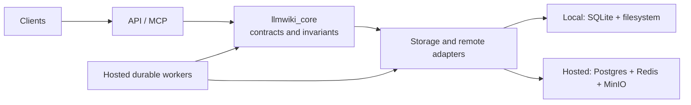

# Platform architecture overview

LLMWiki has two runtime modes behind one set of domain contracts. This page
defines their shared boundaries and points to the documents that own the
detailed contracts.

## Capability status

All four platform-architecture milestones are implemented on
`feat/platform-architecture-evolution`: the shared kernel, durable Hosted
jobs, hybrid retrieval, and server-side RAG. Hybrid retrieval and server-side
RAG are independently gated and default off. Lexical retrieval remains the
default, while local mode remains usable without an embedding or model service.

## Layers and dependency direction

`llmwiki_core` is the dependency-free contract layer: it defines domain values,
invariants, and algorithms but imports neither framework nor infrastructure
code. Adapters own database, filesystem, object-storage, and remote-service
integration. API and MCP are transports over those contracts; Hosted workers
provide durable execution rather than an additional source of business truth.

The precise shared-kernel boundary, data invariants, and local/Hosted adapter
semantics are owned by [the shared-kernel contract](shared-kernel.md).

## Runtime modes

Local mode is a single-user, offline path: SQLite indexes and derives state
from files in the local filesystem, and MCP can run the workflow without a
network dependency. Hosted mode uses Postgres, Redis, and MinIO/S3-compatible
object storage; API replicas are stateless and workers execute accepted work
durably. Server-side RAG is Hosted-only. MCP retains the offline Local workflow
and does not require server-side RAG.

## Storage ownership

| Store | Owner and role |
|---|---|
| SQLite | Local index and derived state; local workspace files remain the source content. |
| Postgres | Authoritative Hosted jobs, RAG runs, wiki versions, and derived state. |
| Redis | Hosted job UUID delivery and short-lived multipart-upload coordination; never business truth. |
| MinIO | Hosted source and upload bytes through its S3-compatible API. |
| PGroonga | Hosted lexical-search indexes and ranking. |
| pgvector | Hosted, versioned chunk embeddings for explicitly enabled hybrid retrieval. |

Postgres publishes related Hosted document and wiki state transactionally; it
does not make external object bytes part of the same transaction. See the
[shared-kernel contract](shared-kernel.md), [durable-job contract](durable-jobs.md),
and [retrieval contract](retrieval.md) for their respective boundaries.

## Request and data flows

- **Synchronous reads:** API or MCP validates a request against shared contracts
  and reads through the selected Local or Hosted adapter. Search stays lexical
  by default; the canonical retrieval behavior is in [retrieval.md](retrieval.md).
- **Durable document processing:** Hosted ingestion records a Postgres job,
  Redis delivers its UUID, and a lease-owning worker extracts and atomically
  publishes the derived document state. See [durable-jobs.md](durable-jobs.md).
- **Embedding lifecycle:** after a current document version is published, an
  idempotent durable embedding job writes a complete, profile-specific vector
  set; retrieval accepts only the current matching profile. See
  [retrieval.md](retrieval.md).
- **Server-RAG page commits:** a Hosted worker executes a lease-fenced run and
  commits each wiki page with its durable page boundary, so later workers resume
  without rewriting committed pages. See [server-rag.md](server-rag.md).

## Scaling and failure boundaries

API replicas keep no authoritative process-local cache and can scale
independently. Hosted workers own live Postgres leases; compare-and-swap and
idempotency prevent duplicate delivery or stale workers from publishing.
Server-RAG recovery resumes at page boundaries, retaining already committed
pages. If a typed vector availability failure occurs on an eligible hybrid
request, the retrieval contract returns lexical fallback; configuration,
authorization, lexical, and unexpected errors remain visible.

## Documentation map

- [Shared kernel and data invariants](shared-kernel.md)
- [Durable Hosted jobs and resumable uploads](durable-jobs.md)
- [Retrieval architecture and hybrid rollout](retrieval.md)
- [Server-side RAG operations](server-rag.md)
- [Self-hosting guide](../self-hosting.md)
- [Agent integration guide](../agent-integration.md)
- [Platform architecture evolution design](../superpowers/specs/2026-07-24-platform-architecture-evolution-design.md)
- [Durable jobs and API scaling design](../superpowers/specs/2026-07-25-durable-jobs-api-scaling-design.md)
- [Server-side RAG orchestration design](../superpowers/specs/2026-07-26-server-rag-orchestration-design.md)
- [Current-state documentation design](../superpowers/specs/2026-07-27-current-state-documentation-design.md)

## Verification baseline

The pre-rewrite publication baseline is commit
`0173f560c6fec03b87ce4f6803f663d2d6983ead` and GitHub Actions run
[`30251808426`](https://github.com/ben0112/llmwiki-goglobal/actions/runs/30251808426).
This is historical evidence only: the final exact-SHA documentation run is the
publication gate reported at handoff.
