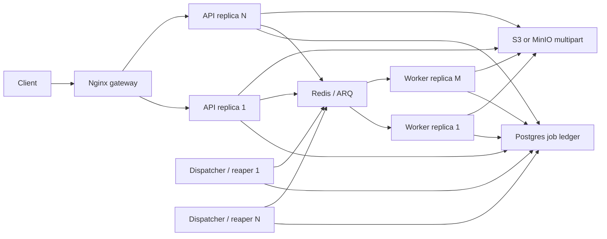

# Durable Jobs and Hosted API Scaling Design

**Status:** Confirmed design, pending implementation plan

**Branch:** `feat/platform-architecture-evolution`

**Date:** 2026-07-25

## Scope and supersession

This design implements the second milestone of the platform architecture
evolution: durable Hosted work and horizontal API scaling. It supersedes the
Milestone 2 queue and upload details in
`2026-07-24-platform-architecture-evolution-design.md` where they differ.
In particular, Hosted execution now uses ARQ over Redis instead of a
Postgres-polled worker, upload session state lives in Redis instead of
Postgres, and Local mode keeps its current in-process behavior instead of
gaining a SQLite job table.

The first release covers Hosted document extraction, Hosted graph rebuilds,
stale upload cleanup, resumable uploads, and the infrastructure required to
run multiple API and worker replicas. Corpus classification, embeddings, and
server-side RAG remain in their later milestones. Local file watching,
extraction, corpus classification, and wiki regeneration remain offline and
do not require Redis, Postgres, or S3.

## Goals

- No accepted Hosted extraction or graph rebuild disappears when an API or
  worker process exits.
- Hosted API replicas are stateless for task execution and resumable upload
  progress.
- API and worker replica counts can be changed independently.
- Duplicate delivery, worker crashes, and expired leases converge without
  publishing duplicate or mixed-version derived data.
- Existing TUS clients keep the same protocol and can resume through a
  different API replica.
- Local all-in-one and MCP compatibility behavior remain unchanged.

## Non-goals

- Exactly-once message delivery.
- Moving Local background loops into Redis.
- Adding corpus classification, embeddings, retrieval evaluation, or RAG job
  handlers in this milestone.
- Building a general workflow engine or exposing arbitrary user-defined jobs.
- Sharing live WebSocket objects between API replicas.

## Selected architecture

The selected stack is ARQ with Redis, a separate async worker service, a
Postgres job ledger, and S3/MinIO multipart uploads. Postgres is the source of
truth for job state. Redis provides delivery, upload session state,
distributed locks, and short-lived quota reservations. S3 is the source of
truth for uploaded bytes.

The delivery guarantee is at least once. Job handlers therefore use stable
job IDs, database compare-and-swap claims, document ownership checks, and the
atomic derived-content writers introduced by the shared-kernel milestone.

## Durable job ledger

An additive Postgres migration creates `background_jobs`. The table contains:

- `id UUID` primary key;
- `job_type TEXT` constrained to the handlers enabled by this milestone;
- `user_id UUID`, optional `knowledge_base_id UUID`, and optional
  `document_id UUID` for tenant and resource scope;
- `state TEXT`: `queued`, `running`, `retry_wait`, `succeeded`, `failed`, or
  `cancelled`;
- bounded `payload JSONB`, `progress JSONB`, and `result JSONB`;
- `idempotency_key TEXT` with a tenant-and-type-scoped partial unique index;
- `attempt_count`, `max_attempts`, and `run_after`;
- `lease_owner`, `lease_expires_at`, and `heartbeat_at`;
- `last_dispatched_at` and `dispatch_attempts`;
- bounded `error_code` and `error_message` fields;
- `cancel_requested_at`, `created_at`, and `updated_at`.

Payloads contain identifiers and normalized options, never secrets, source
bytes, full extracted text, presigned URLs, or credentials. Result and error
fields have explicit size limits before persistence.

The initial job types are:

- `document.extract`: extract one existing Hosted source object, replace its
  pages/chunks/assets atomically, and publish the matching document version;
- `graph.rebuild`: rebuild content-derived edges and facet rollups for one
  knowledge base;
- `upload.cleanup`: abort one expired multipart upload and release its quota
  reservation. The scheduled scan creates one ledger job per stale session,
  using the upload ID as its idempotency key.

Creating a document and its `document.extract` job happens in the same
Postgres transaction. Graph requests create a job after validating ownership.
The same tenant, type, and idempotency key returns the existing job rather than
creating competing work.

## Dispatch, claim, and recovery

Each worker deployment may run a dispatcher and lease reaper. Multiple copies
are safe:

1. A dispatcher selects due `queued` or `retry_wait` rows with
   `FOR UPDATE SKIP LOCKED`.
2. It submits the database UUID as the ARQ `_job_id`, then records the dispatch
   attempt. Rows remain eligible for periodic redelivery while they are not
   terminal, so a crash between Redis and Postgres cannot strand work.
3. ARQ workers receive only the UUID. They claim the row with a conditional
   update that checks state, `run_after`, cancellation, and lease expiry.
4. Claiming sets `running`, increments `attempt_count`, and writes a finite
   lease owned by the current worker instance.
5. Long handlers renew their lease and check cancellation between bounded
   phases. A worker that loses its lease must not publish a final result.
6. The reaper changes expired `running` rows to `retry_wait`, or to `failed`
   when the maximum attempt count is exhausted.

ARQ automatic retries are disabled so the Postgres ledger is the only retry
state machine. ARQ result retention is kept short because Postgres owns
durable status. A duplicate Redis message that cannot claim the database row
exits successfully without running the handler.

Default execution permits three attempts. Retryable failures use exponential
backoff with jitter. Network timeouts, transient Redis/S3/converter failures,
and transient database errors are retryable. Invalid formats, missing owned
resources, authorization failures, and quota failures are terminal.

## Handler behavior

### Document extraction

All Hosted paths that currently call `spawn_logged(ocr.process_document(...))`
create a durable `document.extract` job instead. This includes completed TUS
uploads, URL PDF ingestion, and startup recovery. Hosted API startup no longer
launches extraction coroutines.

`OCRService` is split so the worker invokes an exception-transparent handler.
The handler sets `processing` only after it owns the job lease. Retryable
failure returns the document to `pending` with a bounded error summary; a
terminal or exhausted failure sets `failed`; success uses
`replace_derived_content` to publish content, pages, chunks, assets, version,
and `ready` atomically. The handler revalidates document ownership and object
identity before reading S3.

### Graph rebuild

The Hosted graph rebuild endpoint stops using module-level asyncio locks and
monotonic cooldown dictionaries. It creates a tenant-scoped `graph.rebuild`
job and returns HTTP 202 with the stable job ID. A partial unique idempotency
key prevents concurrent active rebuilds for the same knowledge base. The
worker uses explicit `user_id` and `knowledge_base_id` filters and retains the
existing transactional replacement of content-derived edges. Curated edges
remain untouched.

### Cancellation and status

`GET /v1/jobs/{job_id}` returns only jobs owned by the authenticated user.
`POST /v1/jobs/{job_id}/cancel` immediately cancels `queued` and `retry_wait`
jobs. For `running` jobs it sets `cancel_requested_at`; the worker exits at the
next lease checkpoint and marks the row `cancelled`. Cancellation never rolls
back an already committed document version.

## Resumable upload design

The TUS HTTP surface remains create, HEAD, and PATCH with the existing headers.
The browser client does not change protocol.

### Redis session

Each upload session stores the owner, knowledge base, filename, logical path,
declared length, committed offset, S3 object key, multipart upload ID, ordered
part metadata, last activity, and quota reservation. Sessions have a TTL
longer than the stale-upload threshold. A per-upload Redis lock has a unique
token, finite TTL, and renewal while a PATCH is active.

Create validates knowledge-base ownership and reserves the declared size.
Quota calculation combines committed Postgres document bytes with Redis
in-flight reservations. A centralized Hosted quota service performs all
storage-producing checks so URL ingestion and resumable uploads cannot bypass
one another. Finalization inserts the document before releasing the Redis
reservation; this ordering may temporarily overcount but cannot oversell.

### PATCH and offset consistency

A PATCH verifies the client offset, obtains the distributed lock, and uploads
one complete request body as an S3 multipart part. The API does not persist
the part on local disk. After S3 returns an ETag, a Redis Lua operation checks
the lock token and old offset, records the part, and advances the committed
offset atomically.

If the client disconnects before a part succeeds, the committed offset does
not advance and the client retries from the previous HEAD response. Locks are
renewed while data is streaming; loss of lock ownership prevents offset
commit. Normal non-final parts respect the S3 minimum multipart part size;
the current 50 MB browser chunks satisfy that constraint. A smaller non-final
PATCH is rejected with the committed offset unchanged and an explicit minimum
part-size error.

### Finalization and cleanup

When committed offset equals declared length, finalization:

1. completes the multipart object from the ordered ETags;
2. checks the final object length;
3. range-reads the first bytes and validates the declared file signature;
4. creates the pending source document and `document.extract` job in one
   Postgres transaction;
5. marks the Redis session complete and releases the reservation;
6. returns the document ID and job ID in response headers.

On signature or size failure, it deletes the object, aborts any incomplete
multipart state, releases the reservation, and removes the session. If the
database transaction fails after S3 completion, cleanup deletes the orphan
object before releasing the session. Finalization uses a stable document ID
and is idempotent if the client retries the final PATCH.

ARQ cron scans stale Redis sessions, acquires the same per-upload lock, aborts
the multipart upload, deletes any completed orphan object, releases the quota
reservation once, and removes the session. Redis operations use token checks
so an old cleanup attempt cannot delete a newly active session.

## Remaining process-local state

Each Hosted API replica keeps only its own live WebSocket objects and JWKS
cache. Every replica opens its own supervised Postgres LISTEN connection;
Postgres delivers each notification to every listener, and each replica sends
the event only to sockets connected to itself. This requires no sticky session
after the WebSocket handshake and no shared socket registry.

Local asyncio locks, file watchers, SQLite write serialization, extraction
semaphores, corpus loops, and wiki regeneration state are explicitly Local
mode concerns and do not prevent Hosted API scaling.

## Deployment topology

Hosted deployment adds:

- Redis with append-only persistence and a named data volume;
- an ARQ worker image/entrypoint that installs the same API and shared-core
  code but starts no HTTP server;
- an Nginx gateway with WebSocket Upgrade forwarding;
- shared `REDIS_URL` and job timing configuration for API and worker.

The API service exposes its port only to the Compose network. Nginx owns the
host port, removing the fixed-port conflict when `docker compose --scale
api=N --scale worker=M` is used. API, MCP, worker, converter, and web replica
counts remain independently configurable.

Service readiness is role-specific: API requires Postgres, Redis, and the
configured object store; worker requires Postgres, Redis, object store, and
configured conversion dependencies. Liveness does not fail for a temporary
downstream outage. Worker logs and metrics include job ID, attempt, lease
owner, user ID, knowledge-base ID, and document ID without source content or
credentials.

## Security and tenancy

Workers use a service database connection because they do not have a request
RLS session. Every query still carries explicit `user_id` and resource IDs,
and a handler rechecks that the document or knowledge base belongs to the job
owner before side effects. Job status and cancellation endpoints filter by
the authenticated user. Redis keys use opaque UUIDs; authorization never
depends on possession of an upload or job ID.

Upload metadata is normalized with the existing logical-path and filename
rules. Redis and job payloads contain no JWTs, API keys, database URLs,
presigned object URLs, or full document content. Persisted errors are bounded
and scrubbed before storage.

## Rollout

The rollout is additive and reversible at each boundary:

1. Apply the `background_jobs` migration and deploy code capable of reading
   the table while `DURABLE_JOBS_ENABLED` remains false.
2. Deploy persistent Redis, the worker, dispatcher, and reaper. Verify health
   and synthetic jobs.
3. Enable durable extraction producers. Stop Hosted startup from spawning
   OCR recovery coroutines only after the reaper successfully recovers seeded
   pending work.
4. Enable Redis/S3 multipart TUS and verify cross-replica resume before
   removing `_uploads` and local Hosted upload temp files.
5. Route graph rebuild through jobs and remove its process-local lock/cooldown.
6. Put Nginx in front of API, scale API and worker to two replicas, and remove
   the single-replica deployment warning.

`DURABLE_JOBS_ENABLED` and `TUS_MULTIPART_ENABLED` permit rollback during
deployment. Only one producer path is active for a document at a time. The
legacy Hosted path is removed after the new path and rollback procedure pass
the full verification matrix. Local mode ignores both flags.

## Testing strategy

Implementation follows red-green-refactor with focused commits and pushes on
the existing branch.

Unit tests cover:

- job state transitions, idempotency keys, backoff, lease renewal, expiry,
  terminal errors, and cooperative cancellation;
- dispatcher redelivery and duplicate ARQ messages;
- Redis upload session serialization, token locks, quota reservations, and
  atomic offset compare-and-set;
- worker error classification and bounded persisted results.

Postgres and Redis integration tests cover:

- concurrent dispatchers using `SKIP LOCKED`;
- duplicate delivery with a single successful database claim;
- worker termination followed by lease expiry and recovery;
- Redis outage after the business transaction, followed by eventual dispatch;
- tenant isolation for job reads, cancellation, and handler resources.

MinIO integration tests cover:

- create on one API instance, HEAD/PATCH/finalize on another;
- interrupted PATCH retry from the previous committed offset;
- ordered multipart completion and object size verification;
- signature rejection, abort, stale cleanup, orphan deletion, and idempotent
  single quota release;
- one pending document and one extraction job after repeated final PATCHes.

Deployment verification builds all affected images and starts two API and two
worker replicas behind Nginx. It exercises HTTP routing, WebSocket delivery,
upload-to-ready processing, graph rebuild, worker crash recovery, and graceful
shutdown. GitHub Actions adds Redis and MinIO services alongside the existing
Postgres job, while keeping SQLite and Local suites independent of external
services.

## Acceptance criteria

- Killing the API that accepted a request does not lose its extraction or
  graph job.
- Killing a worker during extraction eventually produces one current document
  version or one bounded terminal failure.
- Replaying the same ARQ job or final TUS PATCH creates no duplicate document,
  chunks, assets, references, or quota release.
- A TUS upload created on one API replica resumes and completes through
  another replica without shared disk.
- Two API and two worker replicas pass HTTP, WebSocket, upload, extraction,
  and graph rebuild smoke tests.
- Hosted Compose no longer states or enforces a single API replica.
- Local mode starts and passes its full suite without Redis, Postgres, S3, or
  worker configuration.
